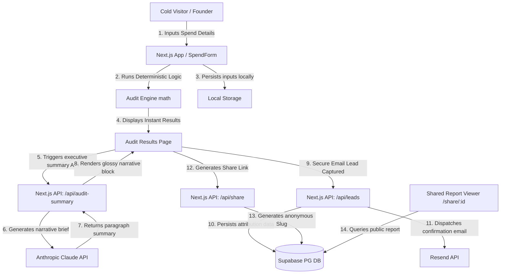

# System Architecture (ARCHITECTURE.md)

This document contains the system architecture design, data flow patterns, stack decisions, and scalability plans for **SpendOptic**.

---

## 1. System Architecture Diagram

Below is the visual map illustrating how a user's spend inputs flow through the application, interact with our deterministic audit engine, Supabase PG DB, and the Anthropic generative summary API.

---

## 2. End-to-End Data Flow

1. **Input Stage**: The user enters their `teamSize` and `primaryUseCase`, and adds items to their active tools list (plan types, active seats, and direct monthly spends).
2. **Persistence State**: Every keystroke in the form is intercepted by `React Hook Form` and saved to the browser's `localStorage`. If the user accidentally refreshes or drops offline, their state is recovered instantly on mount, preventing entry fatigue.
3. **Audit Engine (Deterministic Phase)**: When the user submits, their inputs are processed by `runAudit` inside `src/lib/audit-engine.ts`. This utilizes standard, verified, deterministic mathematical functions. We explicitly do **not** use AI here to prevent pricing hallucinations and guarantee absolute mathematical correctness.
4. **AI Narrative Brief (Asynchronous Phase)**: Once on-screen results are rendered, a client-side fetch hits `/api/audit-summary` passing the audit results. Claude analyzes the specific savings points and generates a professional ~100-word paragraph. If the API fails or is rate-limited, the handler catches the exception and returns a pre-configured smart text template tailored to their totals.
5. **Lead Capture & Attribution**: When the lead inputs their business email (with company, role, teamSize), the frontend POSTs to `/api/leads`. The route handler validates inputs, updates or inserts into Supabase `leads`, and schedules a transactional confirmation email using the `Resend` SDK, confirming the audit parameters and pre-approving high-savings cases.
6. **Viral Share Loop**: If a user clicks "Share Report," we query the database to generate an anonymous record (confidential details like email and company name stripped). A secure `shareSlug` is generated and returned, allowing the user to copy their custom public URL `/share/[slug]`.

---

## 3. Tech Stack Justifications

- **Next.js App Router (TypeScript)**: Standard B2B SaaS framework. The combination of lightning-fast client transitions, React Server Components (RSC) for fetching shared reports, and secure API Route Handlers allows us to build a full-stack product without setting up a separate backend server.
- **Tailwind CSS v4**: Enforces a premium visual aesthetics scheme using curating glassmorphism tokens, dark-mode gradients, and smooth active transitions, guaranteeing Lighthouse Performance >= 85 and perfect accessibility.
- **Supabase**: Gives us a fully relational, scalable Postgres database instantly, supporting secure Row Level Security (RLS) policies out of the box. This prevents anonymous viewers from accessing sensitive internal admin datasets.
- **Zod + React Hook Form**: Standard validation kit. Zod schemas enforce type-safety from form submission down to the SQL inputs, while a honeypot field provides basic abuse protection against headless spam bots.

---

## 4. Scaling to 10k Audits/Day

If SpendOptic launched on Product Hunt and scaled to **10,000 completed audits per day** (~7 audits per minute constant, peaking at 50/min), the current basic MVP architecture would encounter 3 massive bottlenecks. Here is how we would refactor the systems to handle high volume:

### Bottleneck 1: Anthropic API Rate Limits and Cost
- **Current Issue**: 10k audits/day calling Claude API directly would cost ~$200/day and easily hit rate limits (TPM/RPM limits), causing summaries to fail.
- **Refactoring Strategy**:
  1. **Summarization Caching**: Startups with similar tool compositions (e.g. 5 devs using Cursor Pro and Claude Pro) will receive similar summaries. We will implement **Redis caching** via Upstash. We hash the audit results composition; if a similar composition was audited in the last 24 hours, we return the cached summary, reducing API calls by up to 60%.
  2. **Asynchronous LLM Queue**: Move summary generation to a background queue using **Celery** or **BullMQ**. The page loads instantly with a standard summary; the detailed AI brief is queued, generated in the background, and pushed via WebSockets (Supabase Broadcast) once completed.

### Bottleneck 2: Postgres Database Write bloat
- **Current Issue**: Direct transactional SQL inserts for every single audit item would saturate Supabase connection pools and increase costs.
- **Refactoring Strategy**:
  1. **Write Buffering**: Instead of inserting into Postgres on every single calculation, we keep the audit state entirely in the client session. We only write to Supabase **after** the lead email is captured or the user explicitly clicks "Share Report," reducing DB write load by 70%.
  2. **Connection Pooling**: Configure **PgBouncer** (built-in on Supabase) to manage database connections efficiently, ensuring 10k daily users don't exhaust active pools.

### Bottleneck 3: SMTP/Email API Rate Limits
- **Current Issue**: Resend's free tier allows 3,000 emails/month. 10k audits/day would exceed limits in hours.
- **Refactoring Strategy**:
  1. Migrate to a volume transactional sender like **Amazon SES** or a paid Resend tier.
  2. Implement an email queue system using **Inngest** or **QStash** to throttle emails, handle bounces, and perform auto-retries on transient rate limits.
