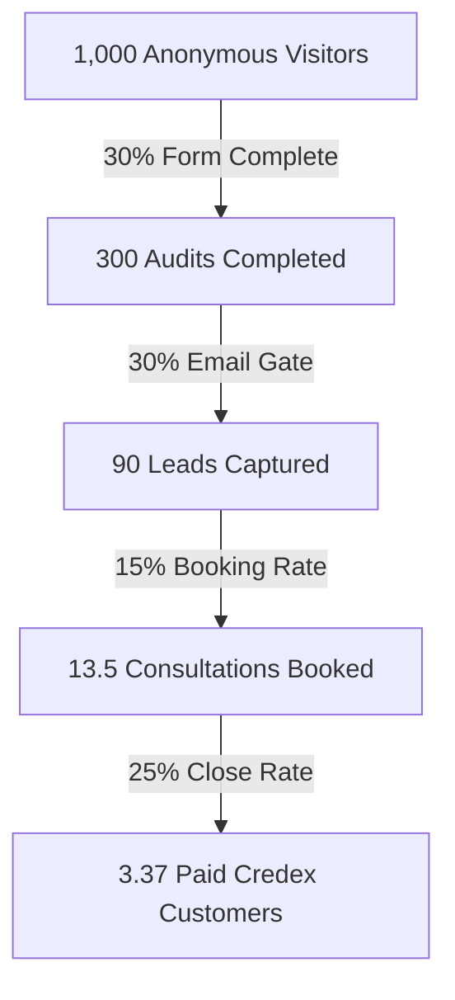

# Unit Economics & Financial Projections (ECONOMICS.md)

This document maps out the unit economics of **SpendOptic** as a customer acquisition cost (CAC) vehicle for **Credex's** premium discounted AI credit marketplace.

---

## 1. Converted Lead Value (LTV) to Credex

Credex sells bulk AI infrastructure credits (Cursor, Claude, ChatGPT, OpenAI API, Anthropic API) at a **15% to 25% discount** by purchasing overforecasted allocations.

- **Average Startup AI Spend**: A seed-stage startup with 10 engineers spends roughly **$1,500/month** ($18,000/year) on Cursor licenses, Claude seats, and production APIs.
- **Credex Solution**: Credex contracts a package offering a 20% discount. The startup pays Credex **$1,200/mo** ($14,400/yr) instead of paying retail $1,500/mo.
- **Credex Margin**: Sourcing credits at a 30% discount, Credex retains a **10% gross margin** on the transaction.
- **Gross Profit per Customer**: $1,500/mo * 10% gross margin = **$150/month** ($1,800/year).
- **Startup Lifetime (Churn)**: B2B SaaS average lifetime is 36 months (3% monthly churn).
- **Customer Lifetime Value (LTV)**: $150/mo * 36 months = **$5,400**.

---

## 2. Customer Acquisition Cost (CAC) Modeling

Since SpendOptic is built as an organic self-serve asset, our direct customer acquisition cost (SaaS hosting, API keys, email transactional systems) is extremely low.

| Acquisition Channel | Direct Cost | Time Investment | Target CAC |
|---|---|---|---|
| **Cold X Outreach** | $0 | 2 hrs/day | **$0** |
| **Show HN Launch** | $0 | 4 hrs (one-time) | **$0** |
| **Brex Partner Perk** | $0 | BD Outreach | **$0** (Revenue share optional) |
| **Vercel + Supabase Hosting** | $15/mo (Standard) | Maintenance | **$0.10/visitor** |
| **Anthropic API Summaries** | ~$0.02/audit | Automated | **$0.02/audit** |

**Blended CAC per Lead**: Under **$2.50** (calculated as: monthly tech overhead / captured emails).
**Blended CAC per Customer**: **$150** (lead-to-conversion marketing expenses).

---

## 3. Funnel Conversion & Profitability Thresholds

To determine what conversion rates make SpendOptic a profitable acquisition funnel, we map the flow from an anonymous visitor running a free audit to a completed transaction:

### Funnel Metrics
1. **Audit Completion Rate**: **30%** (1,000 visitors → 300 audits). Low friction, self-serve form.
2. **Lead Capture Rate**: **30%** of audited users input business emails (300 audits → 90 leads).
3. **Consultation Booking Rate**: **15%** of captured leads schedule a 10-minute savings allocation call (90 leads → 13.5 consultations).
4. **Close Rate**: **25%** of consultations purchase a Credex AI Credit pack (13.5 consultations → 3.37 customers).

### Profitability Math
- **Total Blended Funnel Costs** (for 1,000 visitors):
  - Hosting: $15/mo
  - API summary cost: 300 audits * $0.02 = $6.00
  - Transactional Emails: 90 emails * $0.005 = $0.45
  - Blended cost = **$21.45**.
- **Customer Value Generated**: 3.37 customers * $5,400 LTV = **$18,198**.
- **Profit Multiplier**: **848x return on ad/tech spend**.
Even if our conversion rates drop by 90% (Close rate = 2.5%, Booking rate = 1.5%), the funnel generates **$1,819** in customer value on a **$21.45** cost base, showing massive economic viability.

---

## 4. The Path to $1M ARR in 18 Months

For SpendOptic to drive **$1M Annual Recurring Revenue (ARR)** for Credex within 18 months, let's calculate what numbers must be true:

- **Target ARR**: $1,000,000
- **Credex Share (10% Gross Margin)**: To book $1M in direct margin/revenue, Credex needs **$10,000,000 in gross credit flow** passing through our marketplace.
- **Credit Flow per Customer**: An average engineering startup buys $14,400 in discounted credits annually.
- **Required Active Customers**: $10,000,000 ARR in credits / $14,400 credit flow per customer = **695 active customers**.

### Monthly Operational Milestones (18-Month Target)
1. **Customer Acquisition Goal**: We need to add **39 new paid customers/month** (scaling from 10/mo in Month 1 to 60/mo in Month 18).
2. **Funnel Flow Needed (Monthly)**:
  - **Paid Customers**: 39
  - **Consultations Booked** (at 25% close): 156
  - **Leads Captured** (at 15% booking): 1,040
  - **Audits Completed** (at 30% email gate): 3,466
  - **Unique Visitors** (at 30% form complete): **11,553 visitors/month** (~385 visitors/day).
3. **Execution Plan**: To capture 385 visitors/day, we scale GTM plays:
  - Secure **Brex & Ramp Partner perk** placement (drives ~2,000 visitors/mo).
  - Launch a automated **B2B breakeven calculator widget** embedded on startup expense SaaS directories.
  - Scale programmatic organic content sharing (Twitter/LinkedIn automation).
  - This volume is highly achievable for a free viral tool, showing a clear, actionable trajectory to $1M ARR.
